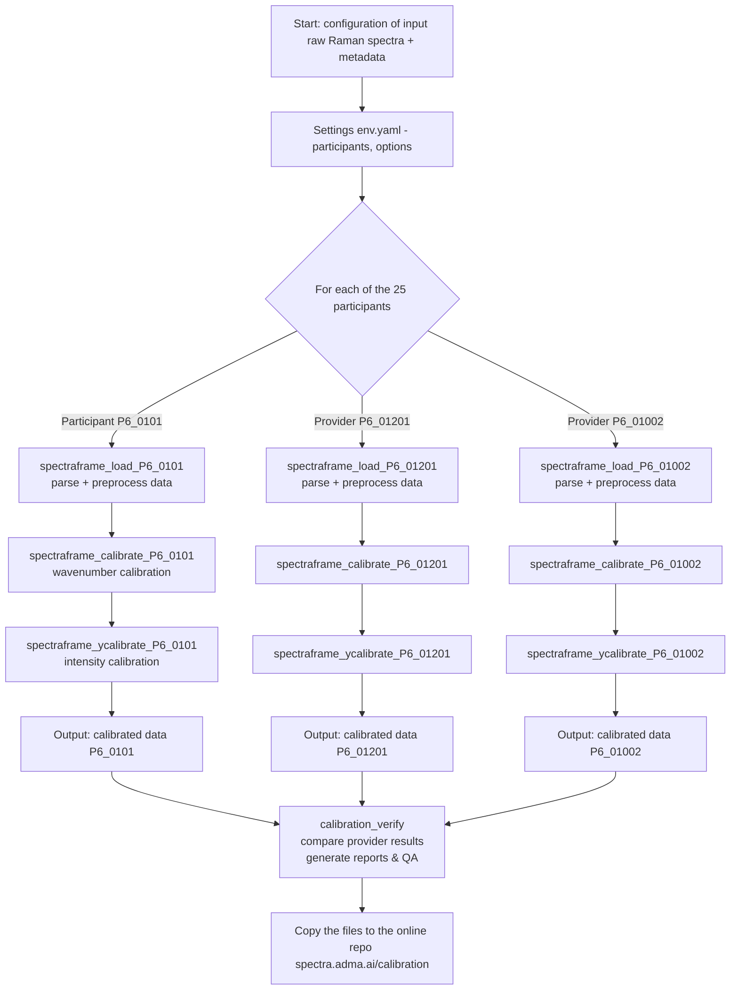

# VAMAS Project 06 – Raman Calibration Data Analysis Pipeline

This repository contains a [Ploomber](https://ploomber.io/)-based analysis pipeline for [VAMAS TWA 42 Project 6](https://www.vamas.org/twa42/documents/2024_vamas_twa42_p6_raman_calibration.pdf).

- implementation of [CWA18133 Raman instruments calibration and verification protocols](https://static1.squarespace.com/static/5fabfc06f012f739139f5df2/t/66ebcf55aa76f94840f51f97/1726730081110/cwa18133-1.pdf) 
- using open source [ramanchada2](https://github.com/h2020charisma/ramanchada2) library [[doi:10.1002/jrs.6789](https://doi.org/10.1002/jrs.6789)].

---



## 📁 Repository Structure

```
src/
├── pipeline.yaml # Defines the Ploomber workflow
├── spectraframe_load.py # Parses metadata and spectra files, substracts background and stores data in dataframe
├── spectraframe_calibrate.py # Wavenumber calibration
├── spectraframe_ycalibrate.py # Relative intensity calibration
├── calibration_verify.py # Generates summary outputs
pyproject.toml
LICENSE
README.md
```

> [Overview](README_overview.md).
> Background on [Ploomber pipeline.yaml](README_ploomber.md#pipelineyaml).

---

## 📦 Quick start

Install [uv](https://github.com/astral-sh/uv). On Linux, use your preferred package manager, e.g., for Arch, use `pacman -Syu uv`. On Windows, open **PowerShell** as a **regular user** and run:
```powershell
powershell -ExecutionPolicy ByPass -c "irm https://astral.sh/uv/install.ps1 | iex"
```

Either clone the repo with Git...
```sh
git clone https://github.com/h2020charisma/vamas_twa42_p6_raman_calibration.git
```
```sh
cd vamas_twa42_p6_raman_calibration
```
...or download the [latest ZIP archive](https://github.com/h2020charisma/vamas_twa42_p6_raman_calibration/archive/refs/heads/main.zip), extract it, and open the extracted directory in a PowerShell, Command Prompt, or other suitable terminal, e.g., in Visual Studio Code.

Setup the Python environment:
```sh
uv sync
```

Run a quick demo with:
```sh
cd src
```
```sh
uv run ploomber build -e pipeline.demo.yaml
```

## 🚀 Usage

### Step 1: Set up configuration

Create or modify `env.yaml` with:

```yaml
config_templates: "config_pipeline.json"
config_root: "path/to/your/data"
config_output: "path/to/output"

fit_ne_peaks: True

ne_tag: "Neon"
si_tag: "S0B"
pst_tag: "PST"
test_tags: "S0N,CAL"
apap_tag: "APAP"
ti_tags: "TiPS_PS,TiPS_Ti"

match_mode: "cluster"
interpolator: "pchip"
```

⚠️ Use paths relevant to your local or server environment. Do not use example paths as-is.

### Step 2: Run pipeline

```sh
uv run ploomber build
```

To run a specific task:

```sh
uv run ploomber task spectraframe_0101 
```

Outputs will be saved under the directory specified in `config_output`.

> Background on [Ploomber pipeline.yaml](README_ploomber.md#pipelineyaml) on task names, grid parameters, and configuraiton keys.

To verify task structure and dependencies without executing:

```sh
uv run ploomber status  # Show task status
```
```sh
uv run ploomber build --dry-run  # Show what would run
```

## 🔄 Pipeline Overview

- [Tasks](README_pipeline.md)
- [Configuration Files](README_config.md)
- [Input Files](README_input.md)


## 🤝 Contributing

See [CONTRIBUTING.md](CONTRIBUTING.md).


## 🔗 References

- [VAMAS TWA 42 Project 6](https://www.vamas.org/twa42/documents/2024_vamas_twa42_p6_raman_calibration.pdf) Project 06
Protocols for Raman instrument calibration and harmonisation of Raman data
- [CWA18133](https://static1.squarespace.com/static/5fabfc06f012f739139f5df2/t/66ebcf55aa76f94840f51f97/1726730081110/cwa18133-1.pdf)  Raman instruments calibration and verification protocols 
- [ramanchada2](https://github.com/h2020charisma/ramanchada2): Raman spectrum I/O and processing tools
- Georgiev, G., Coca-Lopez, N., Lellinger, D., Iliev, L., Marinov, E., Tsoneva, S., Kochev, N., Bañares, M. A., Portela, R. and Jeliazkova, N. (2025), Open Source for Raman Spectroscopy Data Harmonization. J Raman Spectrosc. https://doi.org/10.1002/jrs.6789
- [Ploomber](https://ploomber.io/): Python-native workflow orchestrator

## Acknowledgement

🇪🇺 This project has received funding from the European Union’s Horizon 2020 research and innovation program under grant agreement [No. 952921](https://cordis.europa.eu/project/id/952921).
